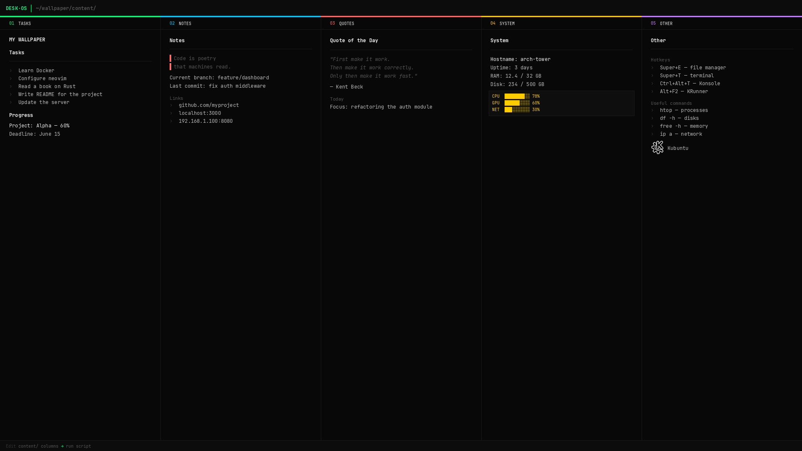

# md2wall



KDE wallpaper generator from Markdown files. Reads columns from the `content/` folder, renders a 1920×1080 PNG and sets it as wallpaper via the KDE API.

## Installation & usage

```bash
git clone https://github.com/makbuk/md2wall
cd md2wall
bash update-wallpaper.sh
```

Pillow is installed automatically on the first run.

## Project structure

```
md2wall/
├── generate_wallpaper.py   — main script
├── settings.py             — all settings
├── update-wallpaper.sh     — run manually or via cron
└── content/
    ├── header.md           — top bar text
    ├── footer.md           — bottom bar text
    ├── column1.md          — column 1
    ├── column2.md          — column 2
    └── ...                 — any number of columns up to MAX_COLUMNS
```

## Columns

Each `columnN.md` file is one wallpaper column. Files are read in alphabetical order.

File format:

```markdown
---
column: 1
title: Tasks
---

## Heading

- list item
- another item

> blockquote

### Subheading

Plain text, **bold text**

    code block

<!-- /column:1 -->
```

- `title:` — column header shown in the column's top bar
- The frontmatter block (`---...---`) and HTML comments (`<!-- -->`) are stripped before rendering

## Images

Place image files in `content/images/` and reference them in any column using Markdown image syntax.

The alt text controls the display size and shape:

```markdown
               — original size
          — rectangle, scaled to 32×32 px
          — circle, diameter 48 px
 KDE      — rectangle with a text label
 KDE      — circle with a text label
```

### Size formats

| Format | Shape | Example |
|---|---|---|
| _(none)_ | original size | ``  |
| `WxH` | rectangle | `` |
| `Nc` | circle, N = diameter in px | `` |

The circle shape crops the image to fit inside a circle of the given diameter — useful for avatars and round icons. The `c` stands for **c**ircle.

Text after the closing `)` is rendered to the right of the image, vertically centered.

PNG transparency is composited correctly. Supported formats: PNG, JPG, and any format supported by Pillow.

## Header & footer

`content/header.md` and `content/footer.md` are plain text files rendered as-is.

Individual words and characters can be colored using `[text](color)` syntax:

```
[DESK·OS](green) │ [~/wallpaper/content/](muted)
```

### Named colors

| Name | Description |
|---|---|
| `green` | accent green (column 1) |
| `cyan` | accent cyan (column 2) |
| `red` | accent red (column 3) |
| `yellow` | accent yellow (column 4) |
| `purple` | accent purple (column 5) |
| `bright` | bright white |
| `main` | default text |
| `muted` | muted gray |
| `dim` | dark gray |
| `#rrggbb` | any hex color |

Text without markup uses the default color (header — `green`, footer — `muted`).

## Settings

All settings are in `settings.py`:

```python
# Resolution
WIDTH  = 1920
HEIGHT = 1080

# Paths
OUTPUT_PNG  = Path.home() / ".config" / "desk-os-wallpaper.png"
CONTENT_DIR = Path(__file__).parent / "content"

# Columns
MAX_COLUMNS = 5   # maximum number of columns

# Layout
TOPBAR_H    = 36  # top bar height (px)
FOOTER_H    = 26  # bottom bar height (px)
COL_PADDING = 22  # inner column padding (px)

# Font sizes
FONT_SIZE_NORMAL = 12
FONT_SIZE_SMALL  = 11
FONT_SIZE_TINY   = 10

# Colors (RGB)
BG          = (8, 8, 8)
COL_COLORS  = [(0,255,136), (0,207,255), (255,107,107), (255,204,0), (200,130,255)]
TEXT_BRIGHT = (238, 238, 238)
TEXT_MAIN   = (187, 187, 187)
TEXT_MUTED  = (85, 85, 85)
TEXT_DIM    = (51, 51, 51)
BORDER      = (26, 26, 26)
```

`COL_COLORS` — accent colors assigned to columns in order (green, cyan, red, yellow, purple).

## Auto-update via cron

```bash
crontab -e
```

Add a line to refresh every 10 minutes:

```
*/10 * * * * bash /path/to/update-wallpaper.sh
```

Cron runs without access to the graphical environment (`$DISPLAY`, `$DBUS_SESSION_BUS_ADDRESS`). The `update-wallpaper.sh` script exports these variables automatically, so no extra cron configuration is needed.

If the wallpaper is not being set, check that the UID in `DBUS_SESSION_BUS_ADDRESS` matches your user. The default is `1000` (the first user on Ubuntu). To verify:

```bash
id -u
```

If the output differs from `1000`, update the path in `update-wallpaper.sh`:

```bash
export DBUS_SESSION_BUS_ADDRESS=unix:path=/run/user/YOUR_UID/bus
```

## Requirements

- Python 3.8+
- KDE Plasma (Kubuntu 22.04+)
- Pillow (installed automatically)
- JetBrains Mono font (optional — falls back to DejaVu / Liberation / Ubuntu Mono)
